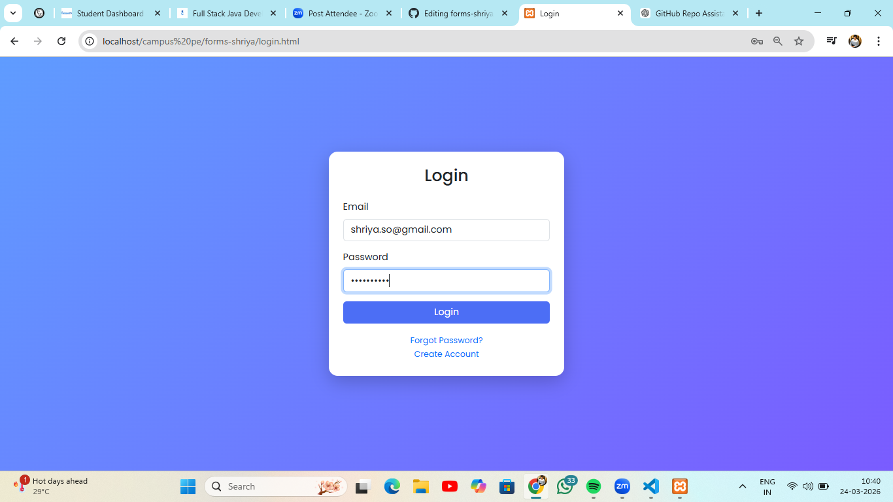
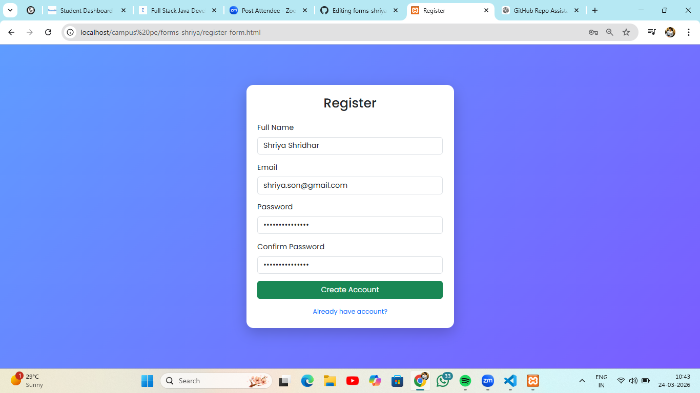
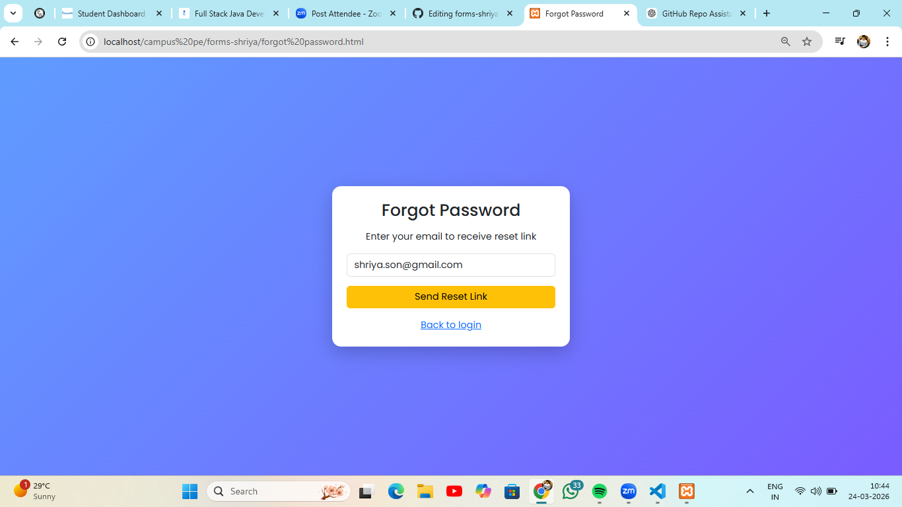
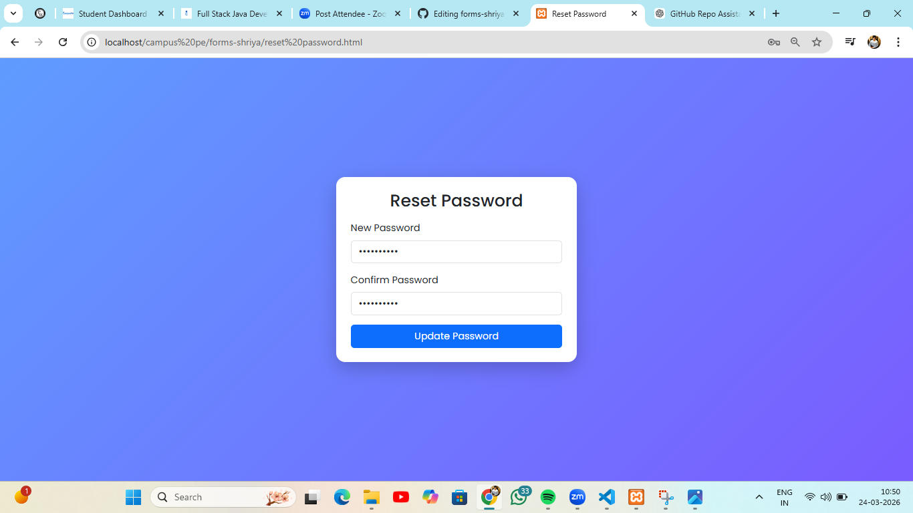
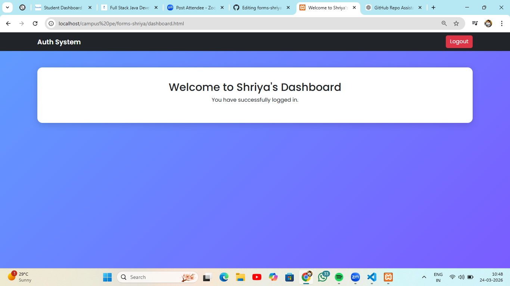

# HTML Authentication 

This project contains 5 basic HTML authentication pages:

This project is a styled authentication system developed as part of the Fullstack Java Development Assignment.
The application includes multiple authentication-related pages designed using HTML, Bootstrap 5, and custom CSS.

The goal of this project is to transform basic HTML pages into a professional, responsive, and visually appealing UI.

Features 
-Fully responsive design (Mobile, Tablet, Desktop)
-Bootstrap 5 integration
-Modern UI using Bootstrap components
-Custom CSS styling (colors, fonts, shadows, hover effects)
-Smooth navigation between all pages
-Clean and structured layout

Pages Included
-Login Page
-Registration Page
-Forgot Password Page
-Reset Password Page
-Dashboard Page

UI & Styling
Custom gradient background
Google Fonts (Poppins)
Card-based layout using Bootstrap
Button hover effects and transitions
Box shadows for better UI depth

Navigation Flow
Login Page
→ Create Account → Registration Page
→ Forgot Password → Forgot Password Page
→ Reset Password → Reset Password Page
→ Login → Dashboard
→ Logout → Back to Login

screenshots are included

Login Page
 
 
Register page
 
 
 Forgot password
 
 
 Reset Password 
 

 Dashboard 
 
 
 
 
 
 
 
